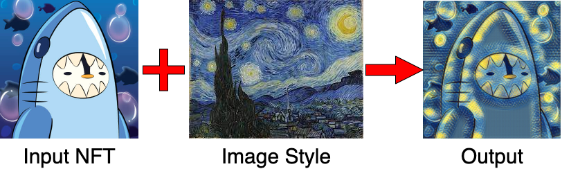
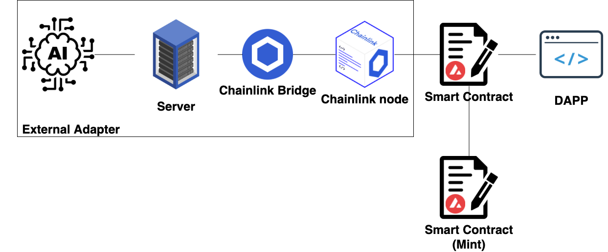
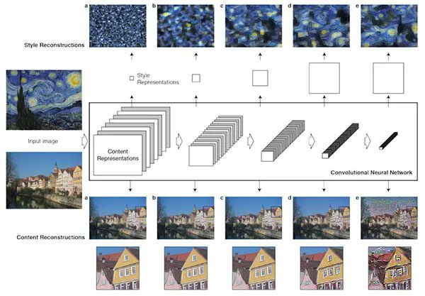

# Chainlink External Adapter on Avalanche: A use case with NFT Art Transfer

## The Project

Allow anyone who owns NFTs to transform them with Neural Art Transfer. This Proof Of Concept shows that it is possible to connect Chainlink external adapter with the Fuji Testnet. 

### How to use it
1. Connect your metamask wallet
2. Select your NFT
3. Choose a style
4. Mint your new NFT !

### The architecture

### How it works

We redefine the existing NFT collections through our neural art transfer algorithm on the blockchain with the use of a <a href="https://docs.chain.link/docs/external-adapters/">Chainlink external adpater</a>.

When a user decide to mint a new NFT with an existing one and a given style, we use our main smart contract. This smart contract is linked to the oracle.

The commonly used definition of an oracle in regards to blockchain technology is to retrieve data from the internet and feed it to a smart contract. Chainlink provides the functionality to do that in a decentralized manner, but it also adds some extra power, by making use of external adapters to produce outputs. In our case, our external adapter uses our own neural network to produce neural style transfer.

So our external adapter returns 2 parameters:
- The first one is the generated image url
- The second one is the style used

Finally, our main smart contract will call the second one to mint the new generated image.

### What is neural style transfer ?

Neural style transfer is the process of taking the style of one image *(in our case an NFT that is available in our wallet)* and then applying it to the content of another image.

Our neural network is mainly based on the paper <a href="https://arxiv.org/abs/1508.06576">A Neural Algorithm of Artistic Style</a> by Leon A. Gatys, Alexander S. Ecker, and Matthias Bethge by training feedforward neural networks that apply artistic styles to images.

Our neural network uses pretrained weights but can be easily retrained with a new style.

### Todo
- [x] Display the owned NFTs when a wallet is connected
- [x] Mint the generated NFT
- [ ] Add new styles
- [ ] Improve documentation to make it easier to people to create external adapter on Avalanche